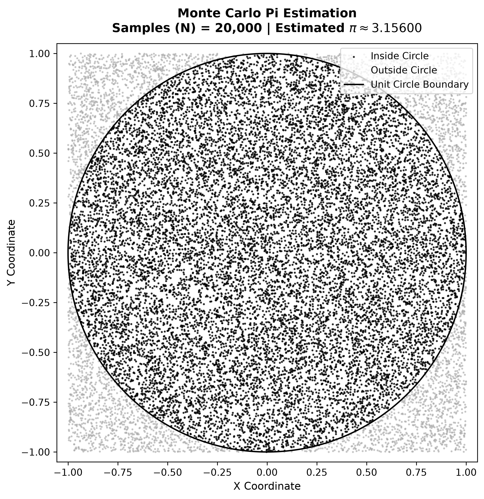
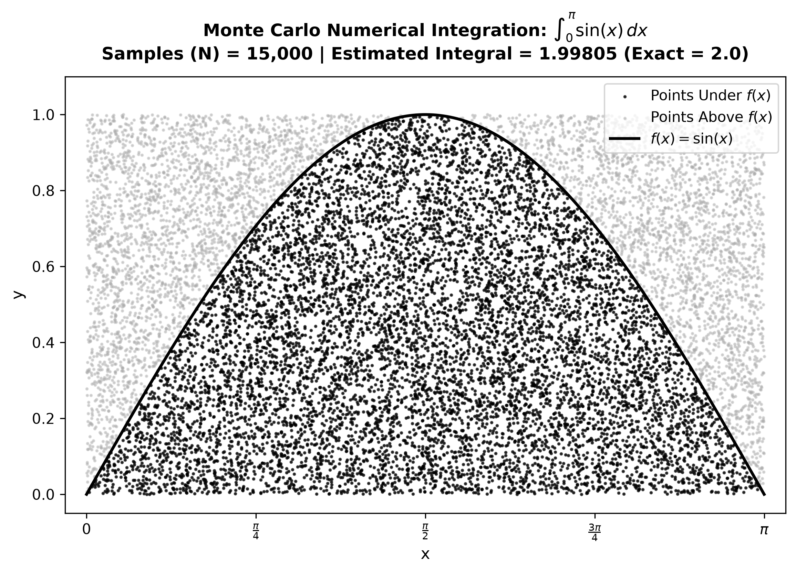
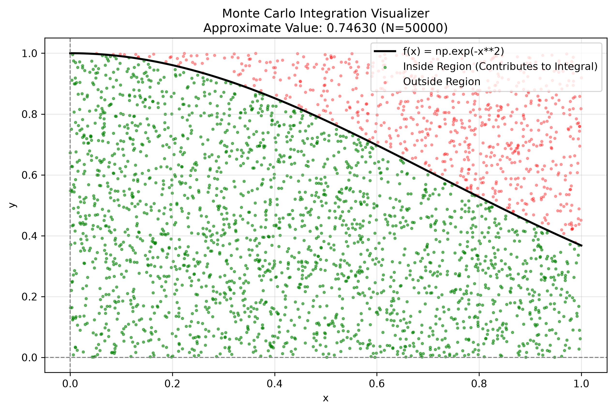
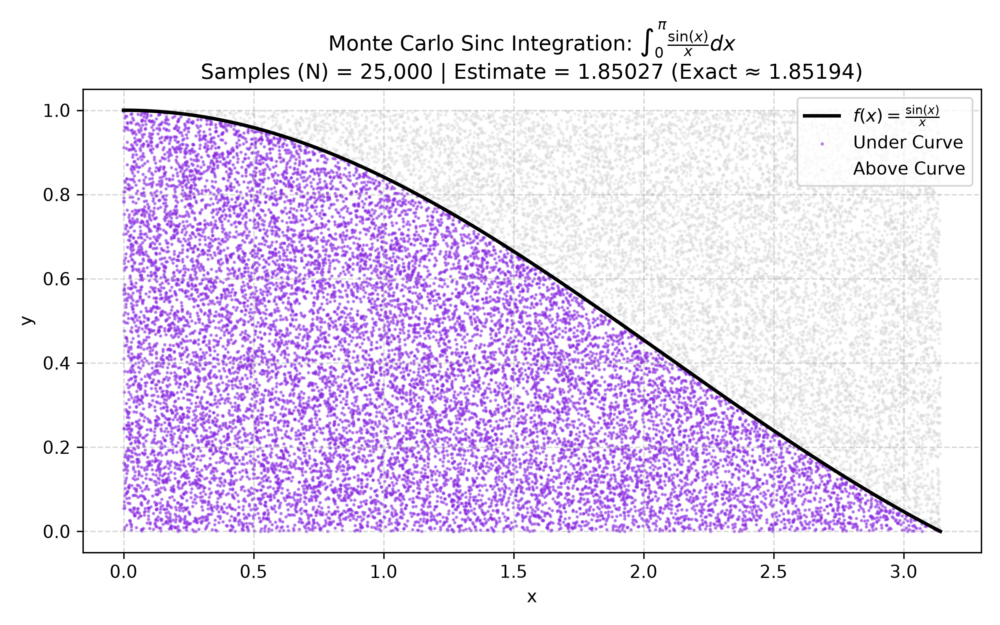

# 02. Monte Carlo Methods in Computational Mathematics

## Overview
This module explores **Monte Carlo simulations**—a class of computational algorithms that rely on repeated random sampling to obtain numerical results. Two core applications are implemented:

1. **Stochastic Pi ($\pi$) Estimation** (`main.py`)
2. **Numerical Integration of Trigonometric Functions** (`integration.py`)
3. **Generalized & Non-Elementary Integration (Gaussian Integral)** (`monte_carlo_integrator.py`)
4. **Sinc Function Integration** (`sinc_integration.py`)
---

## 1. Monte Carlo Pi Estimation (`main.py`)

### Mathematical Principle
Consider a circle of radius $r = 1$ inscribed inside a square with side length $L = 2$ centered at the origin $(0,0)$.

- **Area of the Bounding Square:**
  $$A_{\text{square}} = L^2 = 2 \times 2 = 4$$

- **Area of the Inscribed Circle:**
  $$A_{\text{circle}} = \pi \cdot r^2 = \pi \cdot 1^2 = \pi$$

Generating $N$ uniformly distributed random coordinates $(x_i, y_i) \in [-1, 1] \times [-1, 1]$ yields a sample ratio proportional to the geometric area ratio:

$$P \approx \frac{N_{\text{inside}}}{N_{\text{total}}} = \frac{A_{\text{circle}}}{A_{\text{square}}} = \frac{\pi}{4} \implies \pi \approx 4 \cdot \frac{N_{\text{inside}}}{N_{\text{total}}}$$

A point satisfies the inside condition if:
$$x_i^2 + y_i^2 \le 1$$

### Visualization Output

Click to view simulation plot

---

## 2. Monte Carlo Numerical Integration (`integration.py`)

### Mathematical Principle
Monte Carlo integration estimates definite integrals by taking advantage of the hit-or-miss probability over a bounding region. We evaluate the definite integral of $f(x) = \sin(x)$ over $[0, \pi]$:

$$\int_0^\pi \sin(x) \, dx = \Big[-\cos(x)\Big]_0^\pi = -\cos(\pi) - (-\cos(0)) = 1 + 1 = 2.0$$

#### Bounding Box Setup:
- $x \in [0, \pi]$
- $y \in [0, 1]$ (since $\max(\sin(x)) = 1$ on $[0, \pi]$)
- **Bounding Box Area:** $A_{\text{box}} = (\pi - 0) \times (1 - 0) = \pi$

Points $(x_i, y_i)$ are sampled uniformly within the bounding rectangle. A point lies under the curve if:

$$y_i \le \sin(x_i)$$

The integral value is estimated as:

$$\int_0^\pi \sin(x) \, dx \approx A_{\text{box}} \cdot \frac{N_{\text{under}}}{N_{\text{total}}} = \pi \cdot \frac{N_{\text{under}}}{N_{\text{total}}}$$

### Visualization Output

Click to view simulation plot

---

## 3. Generalized & Non-Elementary Integration (`monte_carlo_integrator.py`)

### Mathematical Principle
While simple functions like $\sin(x)$ can be solved analytically, many functions in physics and probability do not possess elementary anti-derivatives. A classic example is the **Gaussian Integral**:

$$\int_{0}^{1} e^{-x^2} \, dx$$

Since $e^{-x^2}$ cannot be integrated using standard Calculus techniques (e.g., substitution or integration by parts), numerical simulation via Monte Carlo becomes indispensable.

### Bounding Box Setup & Dynamic Sampling
For an arbitrary function $f(x)$ evaluated over $[a, b]$:
- **Bounding Box Area:** $A_{\text{box}} = (b - a) \times (y_{\text{max}} - y_{\text{min}})$
- **Point Sampling:** Uniformly distributed random coordinates $(x_i, y_i) \in [a, b] \times [y_{\text{min}}, y_{\text{max}}]$.
- **Monte Carlo Estimation:**

$$\int_{a}^{b} f(x) \, dx \approx A_{\text{box}} \cdot \left( \frac{N_{\text{under}} - N_{\text{above}}}{N_{\text{total}}} \right)$$

### Visualization Output

Click to view simulation plot

---

## 4. Sinc Function Integration (`sinc_integration.py`)

### Mathematical Principle
Evaluating the non-elementary Sinc integral $\text{Si}(\pi) = \int_{0}^{\pi} \frac{\sin(x)}{x} \, dx$, which exhibits a $\frac{0}{0}$ indeterminate form at $x = 0$ (resolved as $f(0) = 1$):

$$\int_{0}^{\pi} \frac{\sin(x)}{x} \, dx \approx 1.851937$$

### Bounding Box Setup & Sampling
- **Bounding Box Area:** $A_{\text{box}} = (\pi - 0) \times (1 - 0) = \pi$
- **Point Sampling:** Uniform random sampling over $[0, \pi] \times [0, 1]$

### Visualization Output

Click to view simulation plot

---

## Tech Stack & Dependencies
- **Python 3**
- **NumPy** (Vectorized random sampling)
- **Matplotlib** (Data visualization)
