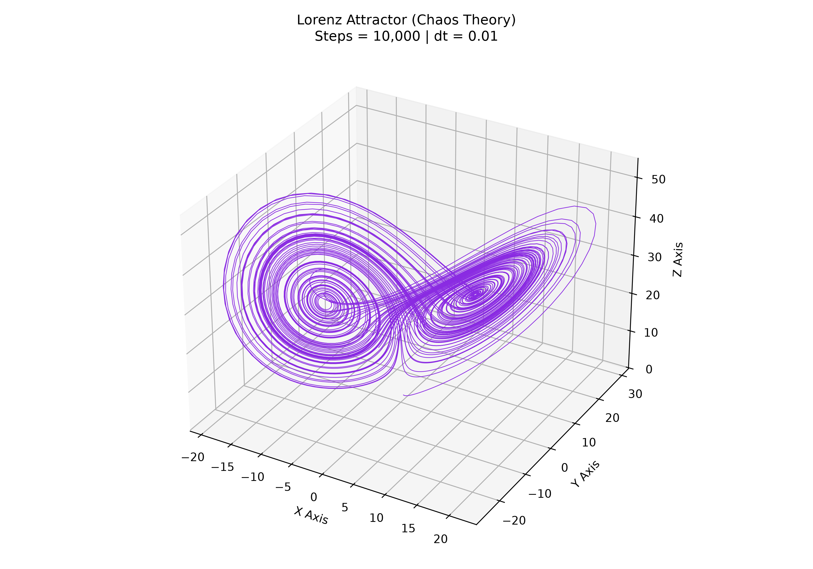

# 03. Chaos Theory & Lorenz Attractor

## Overview
This module models the **Lorenz Attractor**, a system of ordinary differential equations originally derived from atmospheric convection models. It demonstrates **deterministic chaos**, where simple non-linear equations yield complex, non-periodic 3D trajectories—commonly known as the **Butterfly Effect**.

---

## Mathematical Formulation

The system is governed by three coupled non-linear differential equations:

$$\frac{dx}{dt} = \sigma (y - x)$$

$$\frac{dy}{dt} = x (\rho - z) - y$$

$$\frac{dz}{dt} = x y - \beta z$$

### Standard System Parameters
- **$\sigma = 10.0$** (Prandtl number)
- **$\rho = 28.0$** (Rayleigh number)
- **$\beta = 8/3$** (Physical geometry parameter)

---

## Numerical Integration (Euler's Method)

Since the system lacks a closed-form analytical solution, state trajectory points $(x_{n+1}, y_{n+1}, z_{n+1})$ are computed iteratively using first-order numerical integration:

$$x_{n+1} = x_n + \left( \frac{dx}{dt} \right) \Delta t$$

$$y_{n+1} = y_n + \left( \frac{dy}{dt} \right) \Delta t$$

$$z_{n+1} = z_n + \left( \frac{dz}{dt} \right) \Delta t$$

---

## Visualization Output

Click to view 3D Lorenz Attractor plot

---

## Tech Stack & Dependencies
- **Python 3**
- **NumPy** (Array vectorization and array manipulation)
- **Matplotlib** (3D projection and visual styling)