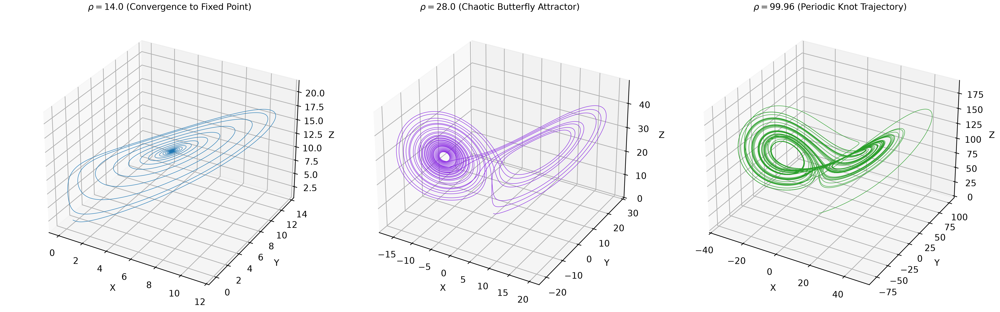
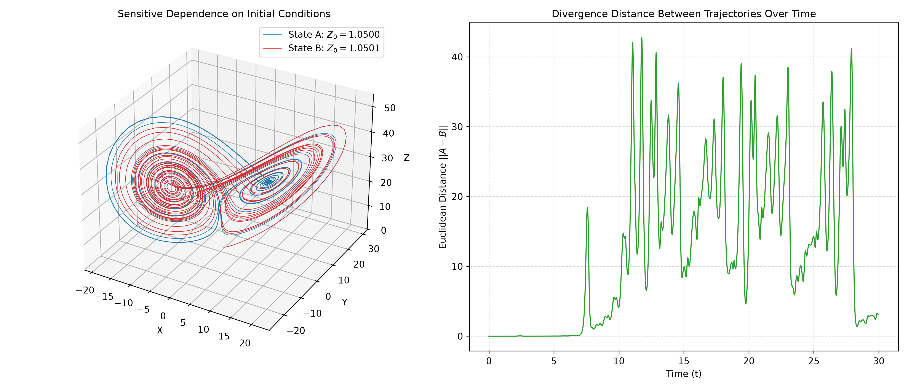

# 03. Chaos Theory & Lorenz Attractor

## Overview
This module explores **deterministic chaos**, dynamical systems, and non-linear ordinary differential equations (ODEs) through numerical simulation of Edward Lorenz's 1963 atmospheric convection model. Three core analyses are implemented:

1. **Standard Lorenz Attractor Simulation** (`lorenz_attractor.py`)
2. **Phase Transitions & Parameter Sweep** (`parameter_sweep.py`)
3. **Sensitivity to Initial Conditions / Butterfly Effect** (`butterfly_effect_sensitivity.py`)

---

## 1. Standard Lorenz Attractor Simulation (`lorenz_attractor.py`)

### Mathematical Principle
The 3D Lorenz attractor is governed by a system of three coupled non-linear differential equations representing simplified atmospheric convection:

$$\frac{dx}{dt} = \sigma (y - x)$$

$$\frac{dy}{dt} = x (\rho - z) - y$$

$$\frac{dz}{dt} = x y - \beta z$$

- **Prandtl Number ($\sigma = 10.0$):** Ratio of momentum diffusivity to thermal diffusivity.
- **Rayleigh Number ($\rho = 28.0$):** Represents the temperature gradient and heating rate.
- **Geometric Ratio ($\beta = 8/3$):** Physical proportions of the fluid layer.

### Numerical Integration Setup (Euler's Method)
State vectors are updated iteratively across discrete time steps $\Delta t = 0.01$:

$$x_{n+1} = x_n + \sigma (y_n - x_n) \Delta t$$

$$y_{n+1} = y_n + \left[ x_n (\rho - z_n) - y_n \right] \Delta t$$

$$z_{n+1} = z_n + \left( x_n y_n - \beta z_n \right) \Delta t$$

### Visualization Output

Click to view simulation plot

---

## 2. Phase Transitions & Parameter Sweep (`parameter_sweep.py`)

### Mathematical Principle
Varying the Rayleigh number $\rho$ alters the thermal convection energy, causing the system to undergo fundamental qualitative phase transitions:

- **Low Energy ($\rho = 14.0$):** Insufficient buoyancy; trajectories spiral inward and decay to a stable fixed point.
- **Critical Convection ($\rho = 28.0$):** Classical chaotic regime featuring infinite non-periodic orbits alternating between two unstable focus points.
- **High Energy ($\rho = 99.96$):** Extreme energy suppresses chaotic divergence, forcing the trajectory into a deterministic closed periodic loop (knot).

### Visualization Output

Click to view simulation plot

---

## 3. Sensitivity to Initial Conditions (`butterfly_effect_sensitivity.py`)

### Mathematical Principle
To quantify the **Butterfly Effect**, two trajectories $A(t)$ and $B(t)$ are integrated simultaneously with an initial spatial perturbation of $\Delta z = 0.0001$:

$$A_0 = (0.0, 1.0, 1.0500), \quad B_0 = (0.0, 1.0, 1.0501)$$

Spatial divergence over time is measured using the 3D Euclidean distance metric:

$$D(t) = \sqrt{(x_A - x_B)^2 + (y_A - y_B)^2 + (z_A - z_B)^2}$$

Positive Lyapunov exponents cause exponential separation, causing initially identical states to decouple into entirely separate wings of the attractor.

### Visualization Output

Click to view simulation plot

---

## Tech Stack & Dependencies

- **`Python 3`**
- **`NumPy`** (Vectorized numerical ODE solvers)
- **`Matplotlib`** (3D trajectory rendering & time-series visualization)