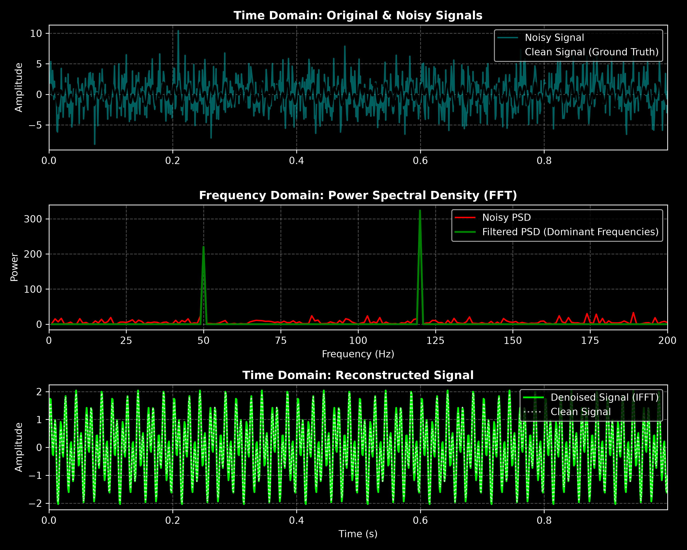
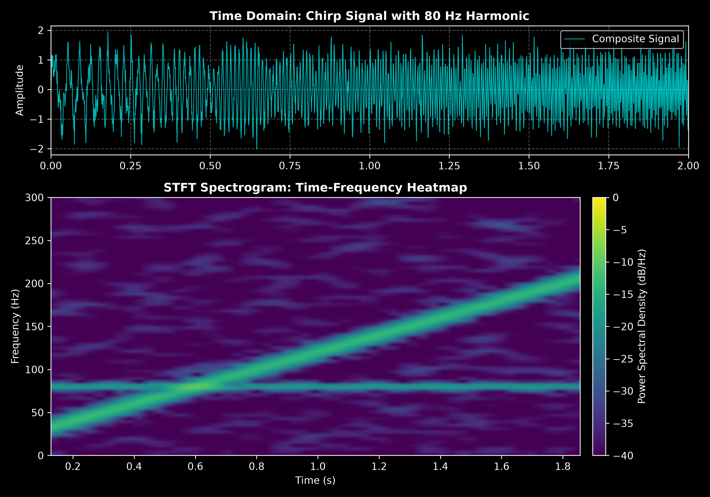
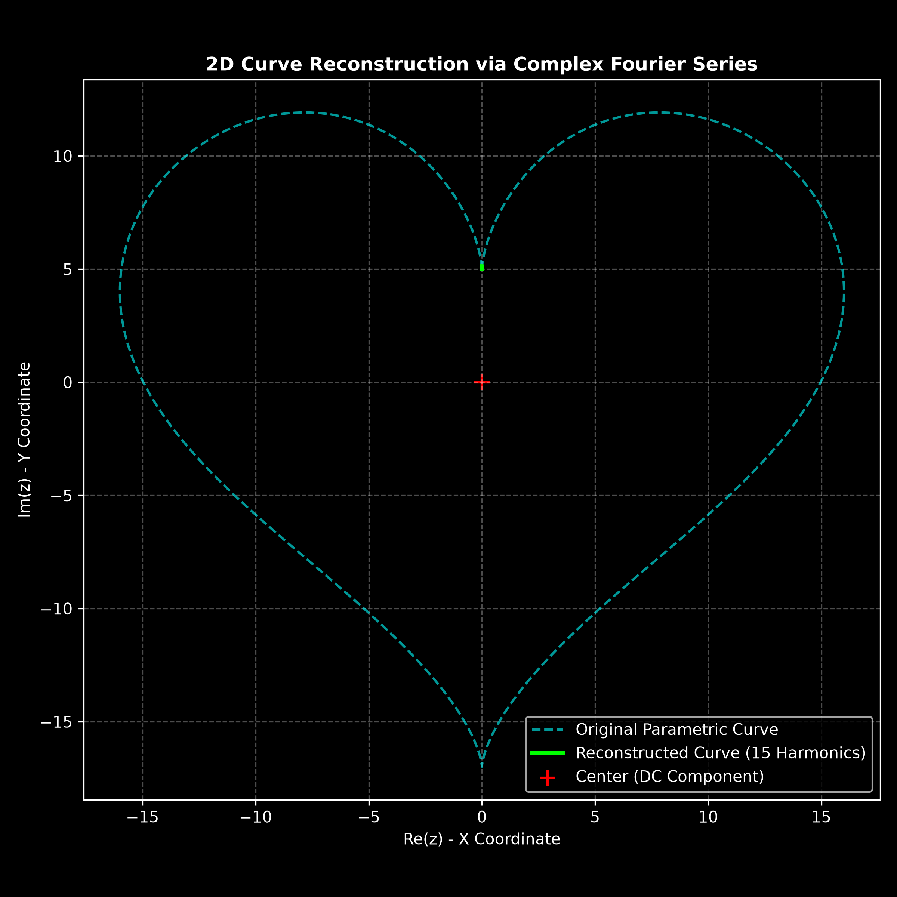

# 04. Fourier Transform & Signal Processing

## Overview
This module explores **harmonic analysis**, spectral signal processing, and orthogonal function decomposition using the **Fast Fourier Transform (FFT)**, **Short-Time Fourier Transform (STFT)**, and **Complex Fourier Series**. Three core analyses are implemented:

1. **Signal Denoising & Spectral Filtering** (`fourier_denoising.py`)
2. **Time-Frequency Spectrogram Analysis** (`audio_spectrogram.py`)
3. **2D Curve Reconstruction via Complex Epicycles** (`fourier_epicycles.py`)

---

## 1. Signal Denoising & Spectral Filtering (`fourier_denoising.py`)

### Mathematical Principle
The Continuous Fourier Transform decomposes a continuous signal $f(t)$ into its constituent frequency components $F(\omega)$:

$$F(\omega) = \int_{-\infty}^{\infty} f(t) e^{-i \omega t} \, dt$$

For discrete time series data $x_k$ with $N$ samples, the Discrete Fourier Transform (DFT) is defined as:

$$X_k = \sum_{n=0}^{N-1} x_n e^{-i 2\pi \frac{k n}{N}}$$

The **Power Spectral Density (PSD)** measures the energy distribution across frequencies:

$$PSD = \frac{|X_k|^2}{N}$$

Frequencies with power below a designated threshold are identified as white noise and zeroed out before reconstructing the signal using the **Inverse Fast Fourier Transform (IFFT)**.

### Visualization Output

Click to view simulation plot

---

## 2. Time-Frequency Spectrogram Analysis (`audio_spectrogram.py`)

### Mathematical Principle
Standard Fourier Transform lacks temporal localization. To capture time-varying frequencies (e.g., chirp signals), the **Short-Time Fourier Transform (STFT)** divides the signal into overlapping windowed segments using a Hann window $w(n)$:

$$STFT\{x[n]\}(m, \omega) = \sum_{n=-\infty}^{\infty} x[n] w[n - m] e^{-i \omega n}$$

The resulting spectrogram plots the energy density $|STFT(m, \omega)|^2$ across a 2D time-frequency plane.

### Visualization Output

Click to view simulation plot

---

## 3. 2D Curve Reconstruction via Complex Epicycles (`fourier_epicycles.py`)

### Mathematical Principle
Any closed 2D parametric curve can be mapped onto the complex plane as $z(t) = x(t) + i \cdot y(t)$. The complex Fourier coefficients $c_n$ represent the radius, phase, and rotational speed of stacked rotating circles (epicycles):

$$c_n = \frac{1}{T} \int_{0}^{T} z(t) e^{-i \frac{2\pi n t}{T}} \, dt$$

Summing the $K$ dominant harmonic vectors reconstructs the continuous geometry:

$$z(t) \approx \sum_{n=-K}^{K} c_n e^{i \frac{2\pi n t}{T}}$$

### Visualization Output

Click to view simulation plot

---

## Tech Stack & Dependencies

- **Python 3**
- **NumPy** (Vectorized Fast Fourier Transform computations)
- **SciPy** (Signal processing & STFT spectrogram algorithms)
- **Matplotlib** (High-contrast spectral heatmaps & multi-panel plots)