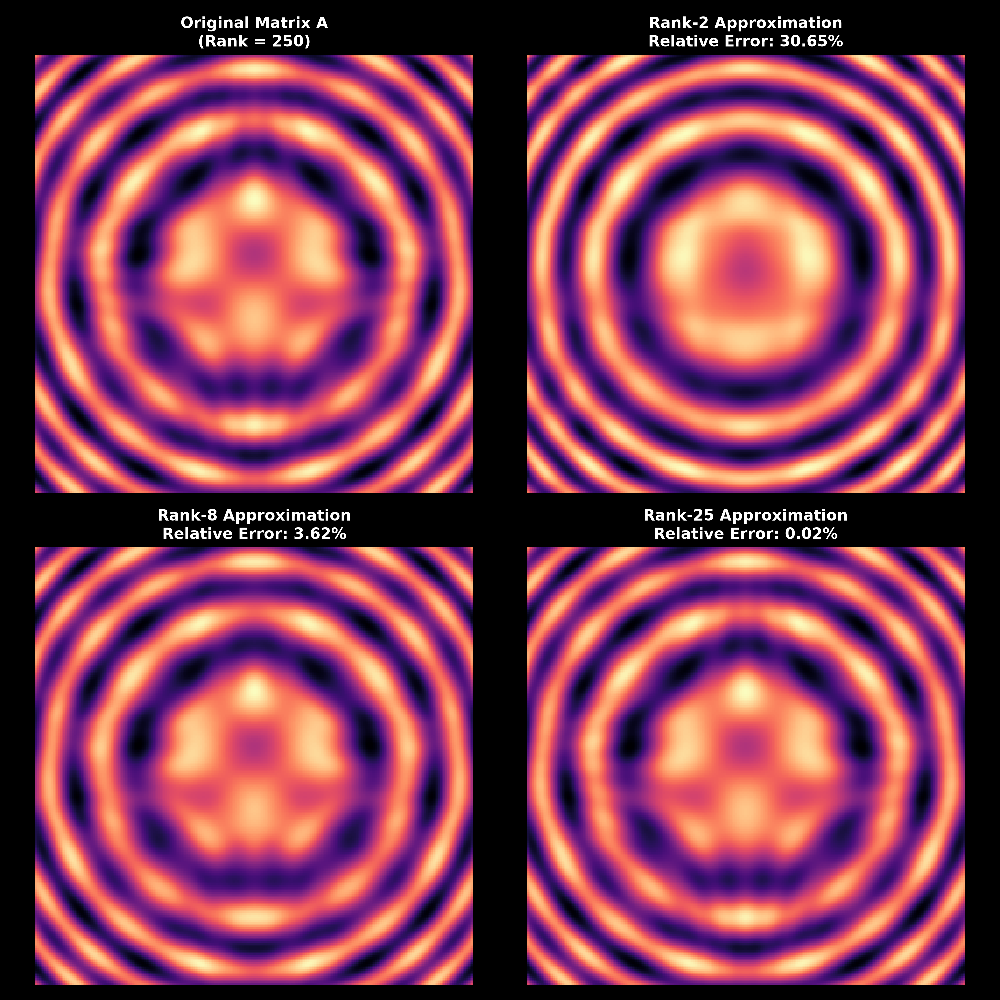
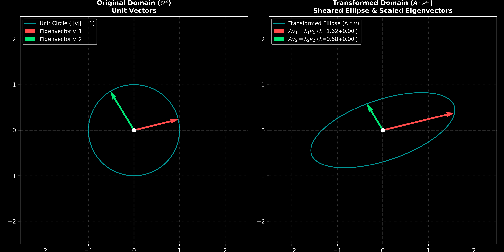
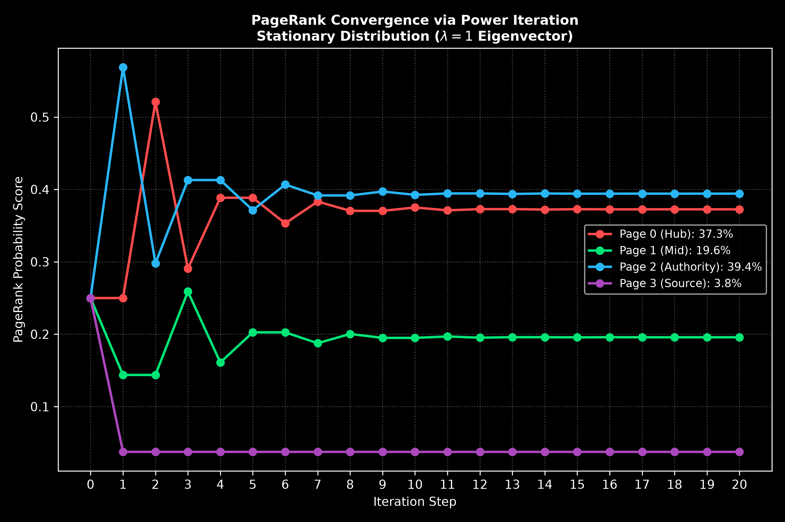

# 05. Linear Algebra & Matrix Decompositions

## Overview
This module explores **matrix factorizations**, **eigenvalue spectral analysis**, and **stochastic Markov chains** applied to computational data compression, spatial transformations, and graph centrality. Three core analyses are implemented:

1. **Image Compression via SVD** (`svd_image_compression.py`)
2. **Eigenvalue Geometric Transformations** (`eigen_transformations.py`)
3. **Google PageRank Simulation** (`pagerank_simulation.py`)

---

## 1. Image Compression via SVD (`svd_image_compression.py`)

### Mathematical Principle
According to the **Eckart-Young-Mirsky Theorem**, any matrix $A \in \mathbb{R}^{m \times n}$ can be decomposed into orthogonal singular vectors and singular values:

$$A = U \Sigma V^T = \sum_{i=1}^{r} \sigma_i u_i v_i^T$$

Truncating the summation to the $k$ dominant singular values yields the optimal rank-k low-rank approximation:

$$A_k = \sum_{i=1}^{k} \sigma_i u_i v_i^T$$

The reconstruction fidelity is quantified using the relative Frobenius norm error:

$$\text{Error} = \frac{\Vert{}A - A_k\Vert{}_F}{\Vert{}A\Vert{}_F}$$

### Visualization Output

Click to view simulation plot

---

## 2. Eigenvalue Geometric Transformations (`eigen_transformations.py`)

### Mathematical Principle
Eigenvectors $v$ represent invariant spatial directions under linear transformations, scaled exclusively by their corresponding eigenvalue $\lambda$:

$$A v = \lambda v$$

Applying a non-symmetric transformation matrix $A$ maps the unit circle $\{v \in \mathbb{R}^2 \mid \Vert{}v\Vert{} = 1\}$ into an ellipse. The principal axes of deformation align directly with the invariant eigenvector directions:

$$v_{\text{transformed}} = A v = \lambda v$$

### Visualization Output

Click to view simulation plot

---

## 3. Google PageRank Simulation (`pagerank_simulation.py`)

### Mathematical Principle
A web network is modeled as a column-stochastic transition matrix $P$. With a damping factor $d = 0.85$, the Google PageRank transition matrix $M$ is defined as:

$$M = d P + \frac{1 - d}{N} \mathbf{E}$$

The stationary probability distribution vector $v$ represents the long-term equilibrium state and corresponds to the dominant eigenvector for $\lambda = 1$:

$$M v = 1 \cdot v$$

The stationary vector is computed via Power Iteration until numerical convergence:

$$v_{t+1} = M v_t$$

### Visualization Output

Click to view simulation plot

---

## ## Tech Stack & Dependencies

- **Python 3**
- **NumPy** (Linear algebra routines, matrix factorizations & SVD computations)
- **Matplotlib** (Vector field visualizations, geometric transformation plots & convergence curves)
